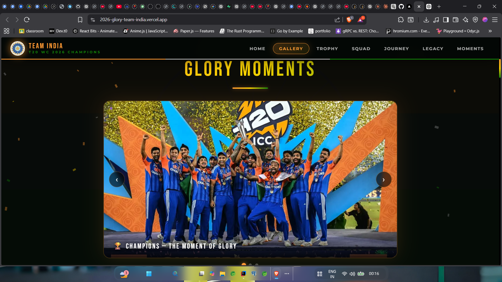

<!-- ================= HERO SECTION ================= -->

<h1 align="center">🏏 2026 Glory Team India</h1>

<p align="center">
A Cinematic Tribute to Team India's Historic T20 World Cup Glory 🇮🇳
</p>

<p align="center">

</p>

---

# 🌐 Live Website

🚀 **Explore the Project**

👉 https://2026-glory-team-india.vercel.app/

---

# 🏆 Inspiration

This website celebrates **Team India’s historic triumph in the 2026 ICC Men's T20 World Cup**, where India defeated New Zealand in the final to secure their **third title and become the first team to win back-to-back championships**. 🇮🇳

---

# 📸 Project Preview

<p align="center">



</p>

---

# 🧰 Tech Stack

<p align="center">


</p>

<p align="center">


</p>

---

# ✨ Features

🏏 Cricket themed cinematic UI
🎬 Smooth GSAP animations
🌌 3D visual effects using Three.js
📱 Fully responsive layout
🚀 Fast global deployment via Vercel
🎥 Trophy celebration moments

---

# 📂 Project Structure

```
2026_Glory_Team_India
│
├── index.html
├── img_folder
│   ├── images
│   └── Trophyvdo.mp4
│
├── tmp
│
└── README.md
```

---

# ⚡ Deployment (Vercel)

This project is deployed using **Vercel**.

Steps:

1️⃣ Push code to GitHub
2️⃣ Import repository into Vercel
3️⃣ Click **Deploy**

Your site goes live instantly.

---

# 📊 GitHub Stats

<p align="center">


</p>

---

# 📈 Contribution Graph

<p align="center">


</p>

---

# 🐍 Contribution Snake

<p align="center">


</p>

---

# 👨‍💻 Author

**Ankit**

GitHub
https://github.com/ankit-7i

---

<p align="center">
Made with ❤️ for Team India 🇮🇳
</p>
